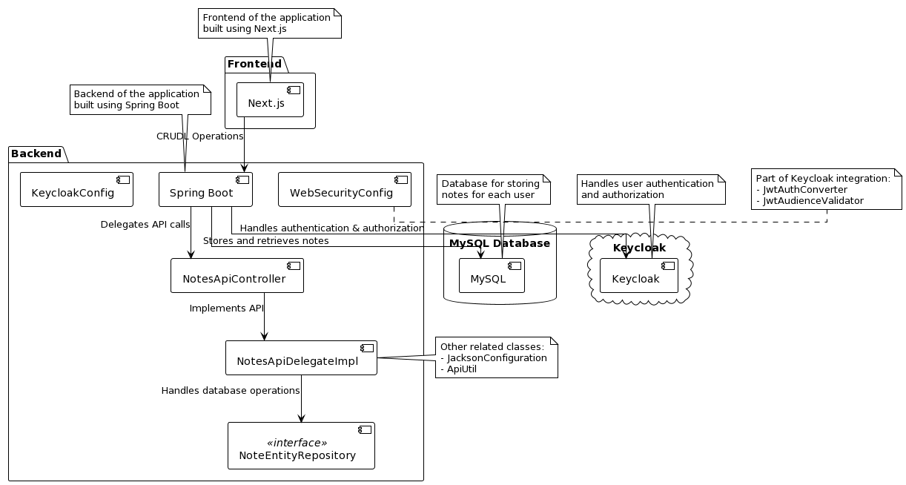
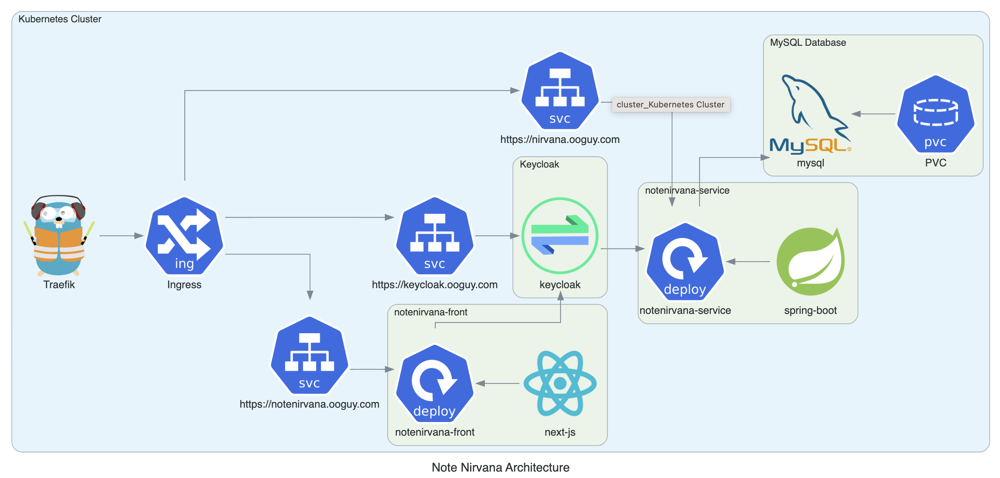

## 23VT-4ME307 Internet Architectures

### Development (Staging) Environments:
```
### Access FrontEnd:
https://notenirvana.1cooldns.com

### Access Backend:
https://nirvana.1cooldns.com
```

### Production Environment:
```
### Access FrontEnd:
https://notenirvana.4cloud.click

### Access Backend:
https://nirvana.4cloud.click
```

## Pipeline:
1. Any commit to the `main` branch triggers the build. If successful, builds are then deployed to the `staging` environment.
2. Any commit to the `main` branch with the format `release x.x.x`, where x is a digit, will also trigger a build, but it will also create a release candidate, it will create a new `tag`, with version `x.x.x`, changelogs will be fetched from the location `changelog/x.x.x.md`, and the release will be created.
3. The release will then be deployed the `production` environment.
4. Everything is automated with no manual intervention.
5. For minor commits in `main` branch, it can be done with a commit that ends with `[skip-ci]`, which will ensure that a build is not triggered.
6. Erroneous commits will result in a built being failed and it will then not be deployed.

## Note Nirvana - a Note Taking App
Note Nirvana is a web-based note-taking app that helps you stay organized and on top of your ideas. 
With a sleek and intuitive interface, Note Nirvana makes it easy to create, edit, and manage your notes from anywhere.
## Key Features
- **Create and Edit Notes:** Quickly create new notes and edit existing ones using a simple, user-friendly interface.
- **Organize Your Notes:** Sort and categorize your notes by tags, folders, and dates to stay on top of your ideas and projects.
- **Search and Filter:** Easily find notes by searching for keywords or filtering by tags, folders, or dates.
- **Collaborate:** Share notes with colleagues or friends for seamless collaboration on projects and ideas.
- **Customize Your Experience:** Choose from a range of customizable themes and layouts to make Note Nirvana your own.

## Group Members: (Group - 6)
1. Prasannjeet Singh
2. Dennis Demir
3. Sudeesh Sukumara Pillai
4. Gauthem Krishna

### Steps to run the application.
**Enusre that `docker` is installed in your computer.**

#### FrontEnd
The `frontend` folder contains the code for the frontend of the application. The frontend is built using NextJS. To run the frontend, follow the steps below:

 1. Open the terminal and navigate to the `frontend` folder.
 2. Run the command `npm run docker:build` to build the docker container.
 3. Run the command `npm run docker:start` to start the frontend server.
 4. The frontend server will start on port 3000. Open the browser and navigate to `http://localhost:3000` to view the frontend.

#### BackEnd
The `backend` folder contains the code for the backend of the application. The backend is built using Spring Framework. To run the backend, follow the steps below:

 1. Ensure that `JDK-17` is in your path. And `JAVA_HOME` environement variable points to `JDK17`.
 2. Backend server will start at `http://localhost:8080`. Ensure that port `8080` in `localhost` is not busy.
 3. Open the terminal and navigate to the `backend` folder.
 4. Run the command `mvn clean install` to build the backend. It will build the application and create a docker image.
 5. Navigate to `backend/target`, then run the command `docker-compose up` to start the backend server.

Note that you might need environemnt variables so that things run without any error. Contact this group to get appropriate variables.

## Note Nirvana Component-Diagram



## Note Nirvana Application Architecture

The Note Nirvana application is a note-taking app that provides basic CRUDL (Create, Read, Update, Delete, List) functionalities, such as adding, editing, deleting, and retrieving notes. The architecture of the application is designed and deployed in a Kubernetes cluster, ensuring scalability and high availability. The following sections describe the components and their relationships in detail, referring to the annotations in the architecture diagram.



### Kubernetes Cluster

The entire application is deployed within a Kubernetes cluster, which ensures optimal resource allocation, scaling, and management of the app's components. The Kubernetes cluster consists of the following components: Traefik (1), Ingress (2), notenirvana-front (3), notenirvana-service (4), MySQL Database (5), Keycloak (6), and their respective dependencies.

### 1. Traefik

Traefik is a modern HTTP reverse proxy and load balancer used to handle ingress routes in the Kubernetes cluster. It's responsible for routing external requests to the appropriate services within the cluster, managing SSL certificates, and solving the ACME challenge from Let's Encrypt.

### 2. Ingress

Ingress is a Kubernetes component that manages external access to the services within the cluster. In this architecture, Traefik is configured to work with Ingress for handling incoming traffic and routing it to the appropriate internal services. These services include the frontend at `https://notenirvana.ooguy.com`, the backend at `https://nirvana.ooguy.com`, and Keycloak at `https://keycloak.ooguy.com`.

### 3. notenirvana-front

The frontend of the Note Nirvana application (3) is built using the Next.js framework (8) and is deployed as a separate pod within the Kubernetes cluster. The frontend communicates with the backend (notenirvana-service) for all its operations, including CRUDL functionalities for notes. The frontend also interacts with Keycloak for authentication and authorization purposes.

### 4. notenirvana-service

The backend of the application (4) is called notenirvana-service and is built using the Spring Boot framework (9). It is deployed as a separate pod within the Kubernetes cluster. The notenirvana-service handles all the business logic for the application, including note management and user authentication. It communicates with the MySQL database (5) for storing and retrieving notes and with Keycloak (6) for user authentication and authorization.

### 5. MySQL Database

The MySQL database (5) is used for storing notes for each user. It is deployed as a separate pod within the Kubernetes cluster and is connected to the notenirvana-service (4). The MySQL database pod is hosted internally with a cluster IP and cannot be accessed from outside the cluster. A PersistentVolumeClaim (PVC) (7) is used to store the data in the MySQL database, ensuring data persistence even if the pod is restarted.

### 6. Keycloak

Keycloak (6) is an open-source identity and access management solution that handles user authentication and authorization. In this architecture, Keycloak is deployed as a separate pod within the Kubernetes cluster. Both the frontend (notenirvana-front) and the backend (notenirvana-service) communicate with Keycloak for authentication and authorization purposes. Keycloak ensures that only authenticated users can access their notes and perform CRUDL operations.

## Dockerization and Deployment

All the four services (frontend, backend, MySQL database, and Keycloak) are first dockerized, and the resulting Docker images are deployed in the Kubernetes cluster. This approach ensures that each component can be easily updated, scaled, and managed independently.

## Conclusion

The Note Nirvana application architecture consists of a Kubernetes cluster hosting multiple components, including the frontend, backend, MySQL database, and Keycloak. Traefik and Ingress handle incoming traffic, while the frontend and backend services provide the core functionality of the application. The architecture is designed for high availability, scalability, and efficient resource management.

---
### Assignment - 1 : Develop a Web Application
#### Part 1: Design your web application
- Explain the purpose of the application
- Use the theory for web application architectures to explain your design.
- Minimum: include a module that executes the application goal, a module for permanent storage of data, a module for HTML rendering.
  - You choose the web application purpose
  - You choose the technologies used
  - You choose the HTML rendering on the client side or server side.
- Explain the design in a document of 3 pages length maximum
#### Part 2: Implement your web application
- You must be able to deploy all the modules proposed for your web application in Part 1 on your own computer
  - The users will connect to localhost, and the modules can use localhost to communicate between them. 
  - The users will connect to http://localhost:8080
- All the code should be in a single repository in GitLab.lnu.se
  - The root folder of the repository must contain a README file with instructions to install your application.
- To get a grade A or B, you must implement some more advanced features. It is your choice. Some examples:
    - Use more than one database for the persistent storage
    - Distribute the application API module into sub-modules that can be independently deployed on your computer
    - Implement asynchronous communication between modules (message queueing RabbitMQ)
    - Implement access through https instead of http
    - Keep user session
#### Deliverables
- A document on mymoodle with a pdf that includes:
    - 3-page architectural description for part 1
    - The link to your repository in GitLab
    - Give maintainer permissions to Jesper and me (dipeab)
    - Only one submission per group!
- Deadline: April 14th
- A 10-minute presentation where you explain the architecture and show a demo of your web application

